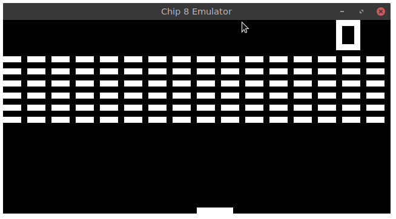

# Chip8-Plus-Plus
A chip 8 emulator written in C++ using SFML

#### Dependencies

	- sfml
	- gcc
	
#### Building:

Just type 

	make 
	
in the root of the repo

#### Running:

Type 

	./chip8 ./roms/[ROM] 

where [ROM] is the game you want to run

This was written with a ton of help from [this blog post](http://www.multigesture.net/articles/how-to-write-an-emulator-chip-8-interpreter/) by Laurence Muller

I also definitely could not have written this without cowgod's chip8 docs [here](http://devernay.free.fr/hacks/chip8/C8TECH10.HTM)
